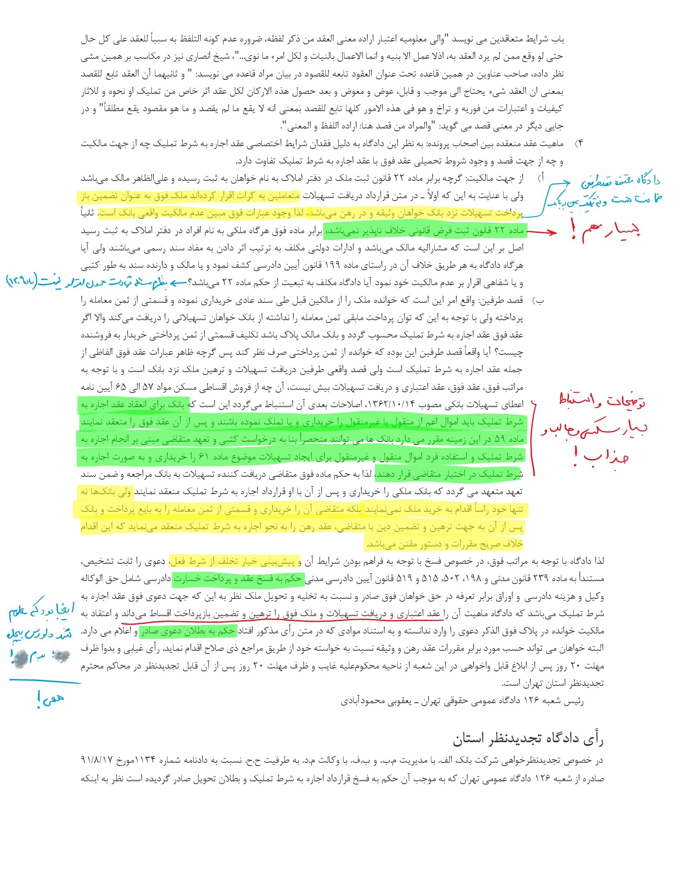

> **«لَوْ اخْتَلَفَ اللِّسَانُ  وَالْقَلْبُ؛   فَالْمُعْتَبَرُ مَا فِی الْقَلْبِ»**
> 
> ###### ****—**  ابن نجیم؛ در اشباه و نظائر؛ ج ۱؛ ص ۳۹ | [لینک به منبع](http://lib.efatwa.ir/43654/1/39/%D8%A7%D8%AE%D8%AA%D9%84%D9%81_%D9%84%D8%B3%D8%A7%D9%86_%D9%82%D9%84%D8%A8#:~:text=%D9%84%D9%8E%D9%88%D9%92%20%D8%A7%D8%AE%D9%92%D8%AA%D9%8E%D9%84%D9%8E%D9%81%D9%8E%20%D8%A7%D9%84%D9%84%D9%91%D9%90%D8%B3%D9%8E%D8%A7%D9%86%D9%8F%D8%8C%20%D9%88%D9%8E%D8%A7%D9%84%D9%92%D9%82%D9%8E%D9%84%D9%92%D8%A8%D9%8F%20%D9%81%D9%8E%D8%A7%D9%84%D9%92%D9%85%D9%8F%D8%B9%D9%92%D8%AA%D9%8E%D8%A8%D9%8E%D8%B1%D9%8F%20%D9%85%D9%8E%D8%A7%20%D9%81%D9%90%D9%8A%20%D8%A7%D9%84%D9%92%D9%82%D9%8E%D9%84%D9%92%D8%A8%D9%90)**

در ادامه مبحث اراده باطنی در مقابل اراده ظاهری در [پست قبل](/posts/%D8%AA%D9%82%D8%A7%D8%A8%D9%84-%D8%A7%D8%B1%D8%A7%D8%AF%D9%87-%D8%A8%D8%A7%D8%B7%D9%86%DB%8C-%D9%88-%D8%A7%D8%B1%D8%A7%D8%AF%D9%87-%D8%B8%D8%A7%D9%87%D8%B1%DB%8C/)، به ذهنم رسید چندتا دعوایی که قبلا از باب عدم تطابق اراده ظاهری و واقعی بررسی کرده بودم رو برای بار چندم بررسی کنم و چیزای جدید یاد بگیرم و draftهامو به اشتراک بذارم. البته باید متذکر بشم این دعوا یک دعوای خاصه، چون دادرس بدوی به زیبایی استدلال می‌کنه عقد در باطن چیز دیگری بوده و ظاهر عقد مخالف روح قانونه. اما در دادرسی تجدیدنظر معلوم می‌شه قاضی جذاب بدوی، حواسش نبوده مطابق ماده ۲ آئین دادرسی مدنی، دادرس از صدور حکم خارج از خواسته منع شده. علی‌ای‌حال، بسیار حکم جالبیه. [لینک به رای در سامانه آرای قوه قضائیه](https://ara.jri.ac.ir/Judge/Text/4639).

> **عنوان: دعوای تأیید فسخ قرارداد**
> 
> پیام: در صورتی که دادگاه، در دعوای تأیید فسخ قرارداد، حکم به فسخ آن صادر نماید، به جهت تفاوت خواسته تأیید فسخ با حکم فسخ (اعلامی بودن تأیید فسخ و تأسیسی بودن حکم فسخ)، موضوع از مصادیق صدور حکم خارج از خواسته خواهان است.
> 
> ### [دانلود pdf فایل draft من](9209970222900384.pdf)

ناخودآگاه یاد این صحنه از فیلم ایندیانا جونز افتادم:

و النهایه:

---

### [دانلود pdf فایل](https://bayanbox.ir/info/5836336286487339381/9209970222900384)

تصویراشم این زیر می‌ذارم اگر حال ندارین دانلود کنین:

***

***

***

